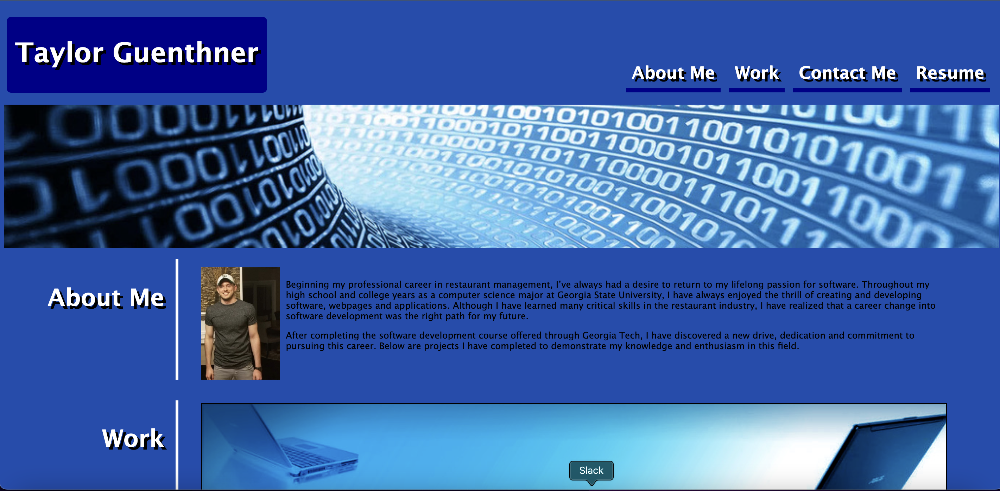

# Creating a Portfolio

In this project, I created a portfolio for my current and future work as a software engineer. The pages displays an about me section, a section for my projects and contact info for my LinkedIn, GitHub and phone number.

## Demo

https://wtguenthner.github.io/Creating-a-Portfolio/

## Screenshots

## Lessons Learned

While creating my portfolio, I learned how to apply CSS to my HTML to give it enhanced styles and visuals. I also learned how to take advantage of attributes such as flex-box and position to format my page.

